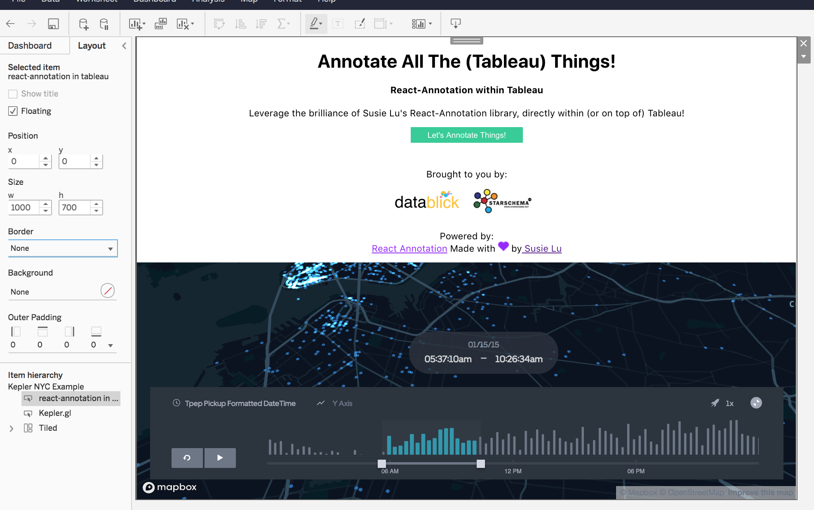

# Annotate All The (Tableau)Things!
### Layering React Annotation on top of Tableau

## Introduction

This is the tableau extension that allows you to layer [Susie Lu's](https://twitter.com/datatoviz?lang=en) [react-annotation](https://react-annotation.susielu.com/) library on top of Tableau. When you add this to your dashboard (you will likely want to cover your entire dashboard with it) you can leverage the majority of annotation types and options available in [react-annotation](https://react-annotation.susielu.com/) directly within Tableau. We have built a simple configuration UI that you can take advantage of to be able annotate your viz to your heart's delight. 

This extension is supported on **Tableau Desktop >=2018.3** and **Tableau Server**. It works best when deployed directly on to the Tableau Server you are using and the content of the extensions is also viewable on **Tableau Mobile**.

## Env Requirements
Tableau Desktop >= 2018.2 and Tableau Server >= 2018.2

This project was bootstrapped with [Create React App](https://github.com/facebook/create-react-app) along with [StarSchema](https://starschema.com/) & [DataBlick's](https://www.datablick.com/) **Tableau Extension Framework**.

## Quick Start
#### Step 1: Locate Annotate All The (Tableau) Things on the [Tableau Community Extensions](https://tableau.github.io/extensions-api/community/) page

Note: If you want the best experience, you should deploy a compiled version of this code directly to your Tableau Server and point your .trex file to that deployment of the extension. 

#### Step 2: Click ‘Allow’ to permit the extension to run.

#### Step 3a: Cover your Dashboard with the Extension Object. The best experience for now is to work with the extension using web edit on Tableau Server. Tableau Desktop is lacking transparency for Extension Objects. You are not required to cover your dashboard, but I found this the easiest way to use React Annotation across your viz. 

#### Step 3b: Click the `Let's Annotate Things!` button. 

#### Step 4: Edit the default annotation to your desire by clicking on the edit icon (pencil) and changing the many configurations. 

